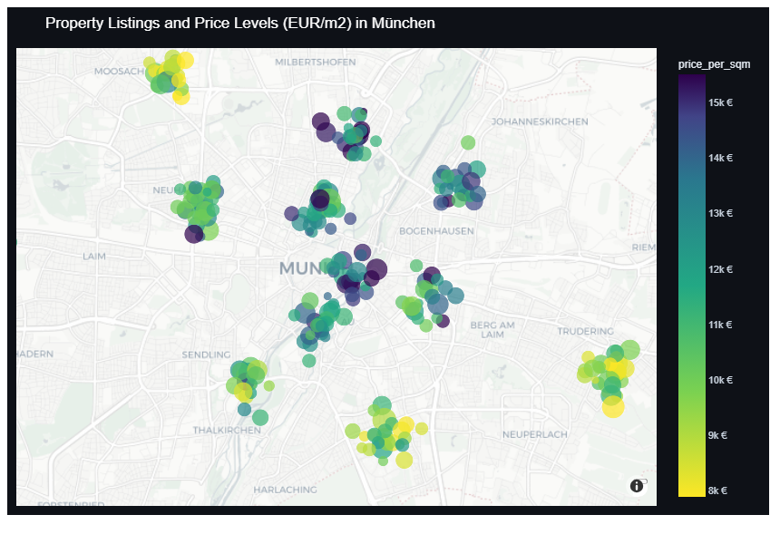
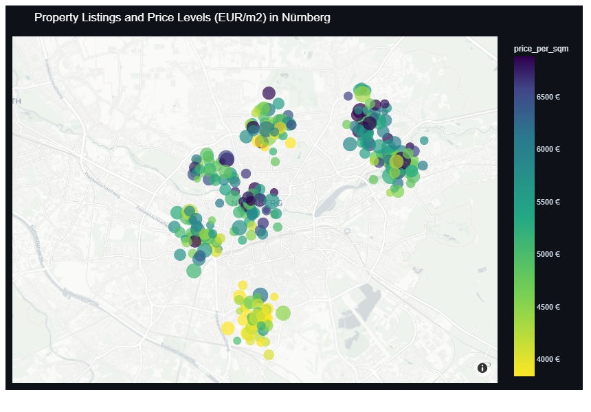
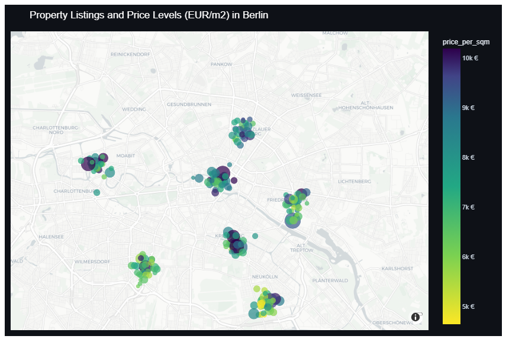

# German Real Estate Market Analyzer & Valuation Engine

A machine learning platform for analyzing German residential real estate markets, predicting fair market valuations with hedonic regression models, tracking historical price trends (2018-2026), and scoring property listings on an explainable 0-100 scale.

Supported regions include Bavarian regional centers (**München, Nürnberg, Regensburg, Passau, Deggendorf, Augsburg, Ingolstadt, Würzburg, Erlangen, Bamberg, Bayreuth, Straubing, Landshut, Rosenheim**) and major German metropolitan areas (**Berlin, Hamburg, Frankfurt am Main, Köln, Stuttgart, Düsseldorf, Leipzig, Dresden, Heidelberg, Freiburg im Breisgau**).

---

## Regional Market Intelligence & Geo-Spatial Price Distribution

Spatial price density maps showing asking price levels per square meter across key German metropolitan centers (with dark purple representing prime, highest-priced real estate locations):

### München (Munich) — Geographic Price Levels (EUR/m²)
Price distribution across Altstadt-Lehel, Schwabing, Bogenhausen, Maxvorstadt, Nymphenburg, Solln, and Pasing:



### Nürnberg (Nuremberg) — Geographic Price Levels (EUR/m²)
Price distribution across Altstadt, Erlenstegen, St. Johannis, Mögeldorf, Gostenhof, and Südstadt:



### Berlin — Geographic Price Levels (EUR/m²)
Price distribution across Mitte, Prenzlauer Berg, Charlottenburg, Kreuzberg, Friedrichshain, and Steglitz:



---

## Machine Learning Valuation, Historical Trends & 0-100 Deal Scoring

### 1. Historical Price Trends & Regression (2018-2026)
Track macroeconomic market cycles: low-interest expansion (2018-2022), interest rate correction (2022-2024), and market stabilization (2024-2026), with forward polynomial regression projections and 95% confidence intervals:


### 2. 0-100 Deal Score & 4-Pillar Evaluation
Evaluate any property listing against four key dimensions: Price Attractiveness (40%), Micro-Location (25%), Building Quality & Energy Standard (20%), and Living Space & Layout Efficiency (15%):


### 3. Explainable Value Drivers & Feature Attributions
Understand the precise monetary impact (in EUR) of individual property characteristics such as living space, micro-location, building age, energy efficiency rating, balcony, elevator, and parking:


### 4. Multi-City Comparison & Gross Rental Yields
Compare benchmark prices per square meter and gross rental yields across German regional markets:


---

## Core Capabilities

- **City-Level Market Intelligence**: Computes average and median price per square meter (EUR/m²), total price distributions, and gross rental yield benchmarks for 25+ German cities.
- **Geo-Spatial Analysis**: Visualizes active property listings and price levels on interactive maps with district-level breakdowns.
- **Property Valuation & Deal Score (Tab 2)**: Evaluates real estate listings from URL input or custom parameters, generating a 0-100 deal score, fair market value prediction, confidence intervals, and negotiation strategies.
- **Historical Price Trends & Regression (2018-2026)**: Models market price dynamics across low-interest expansion, rate corrections, and recovery phases, with forward projections and confidence intervals.
- **Listing URL & HTML Parser**: Extracts asking price, living area, room count, construction year, energy certificate class (A+ to H), and amenities from real estate portals (Immobilienscout24, Immowelt, Kleinanzeigen) and structured JSON-LD / Next.js payloads.
- **Hedonic Valuation Model**: Combines gradient boosting and random forest regression to estimate fair market value, confidence intervals, and feature attributions (monetary impact of space, location, building age, and amenities).
- **0-100 Deal Scoring Engine**: Evaluates listings across four pillars:
  1. Price Attractiveness (40%): Difference between asking price and model-estimated fair market value.
  2. Micro-Location (25%): Proximity to city center, transit hubs, university campus, and district prestige.
  3. Building Quality & Energy (20%): Construction year, renovation status, and energy efficiency rating.
  4. Space & Layout Efficiency (15%): Space-to-room ratio and amenities (balcony, elevator, parking, kitchen).
- **Interactive Web App & CLI**: Provides a full Streamlit dashboard and a standalone command-line evaluation tool.

---

## Installation

### Prerequisites
- Python 3.10 or higher
- pip

### Setup
```bash
git clone https://github.com/walid2004/German-Real-estate-Analyser.git
cd German-Real-estate-Analyser
pip install -r requirements.txt
```

---

## Usage

### 1. Interactive Web Dashboard
Run the Streamlit application:
```bash
streamlit run app.py
```
Open `http://localhost:8501` in your browser.

The dashboard layout features 4 organized modules:
1. **Market Analysis & Geo Map**: Interactive geographic price distribution and district price benchmarks.
2. **Property Valuation & Deal Score**: Instant evaluation of listing URLs with 0-100 deal scores, fair market estimates, and negotiation margins.
3. **Price Trends & Regression (2018-2026)**: Historical macroeconomic trendlines and multi-quarter forecasts.
4. **City Comparison & Top Deals**: Cross-city yield matrices and ranked top deals.

### 2. Command-Line Interface (CLI)

Evaluate a pre-configured sample listing:
```bash
python evaluate_listing.py --city Deggendorf --sample deggendorf_top_deal
```

Evaluate a live listing by URL:
```bash
python evaluate_listing.py --city Passau --url "https://www.immobilienscout24.de/expose/169532521"
```

Evaluate custom property parameters:
```bash
python evaluate_listing.py --city Deggendorf --price 299000 --sqm 93.2 --rooms 4 --year 1985 --energy C --district Schaching --balcony --parking --kitchen
```

---

## Project Structure

```
.
├── app.py                         # Streamlit web dashboard (Tab 1: Geo Map, Tab 2: Valuation & Deal Score)
├── evaluate_listing.py            # CLI property evaluation script
├── requirements.txt               # Project dependencies
├── .github/
│   └── workflows/
│       └── ci.yml                 # GitHub Actions continuous integration workflow
├── assets/                        # High-resolution geo maps (München, Nürnberg, Berlin) & ML charts
├── scripts/
│   └── generate_charts.py         # Script to render geo maps and publication-quality figures
├── src/
│   ├── config.py                  # Configuration constants and scoring weights
│   ├── data/
│   │   ├── german_cities.py       # City registry, coordinates, districts, and benchmarks (25+ German cities)
│   │   ├── market_generator.py    # Realistic market data generator and historical series
│   │   └── data_loader.py         # Data caching and ingestion
│   ├── scrapers/
│   │   ├── base_scraper.py        # PropertyListing schema and data models
│   │   ├── listing_url_parser.py  # URL, HTML, JSON-LD, and Next.js parser for real estate listings
│   │   └── web_scraper.py         # Search scraper and data pipeline
│   ├── ml/
│   │   ├── preprocessing.py       # Feature engineering, transformers, and split logic
│   │   ├── valuation_model.py     # Hedonic valuation ensemble and feature attribution
│   │   └── trend_regressor.py     # Time-series regression and price trend forecaster
│   ├── valuation/
│   │   └── deal_scorer.py         # 0-100 Deal scoring algorithm and negotiation advisor
│   └── utils/
│       ├── geo_utils.py           # Haversine distance and location scoring formulas
│       └── formatters.py          # Currency, area, and energy class formatting
└── tests/
    ├── test_scrapers.py           # Parser and schema tests
    ├── test_ml_models.py          # Model training, validation, and regression tests
    └── test_deal_scorer.py        # Scoring engine and boundary tests
```

---

## Testing

Run the automated test suite with pytest:
```bash
python -m pytest tests/ -v
```

---

## License

MIT License.
