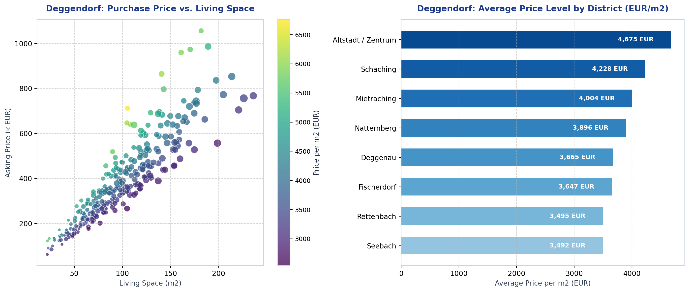
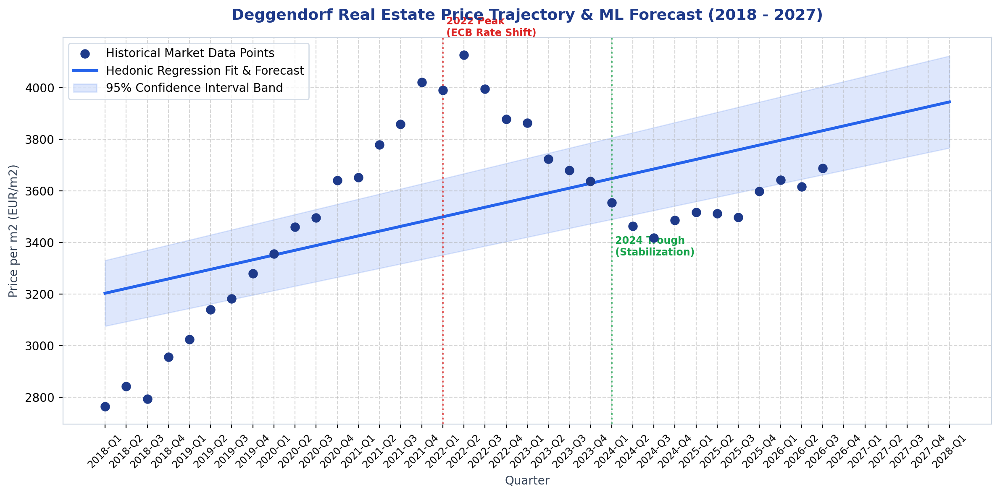
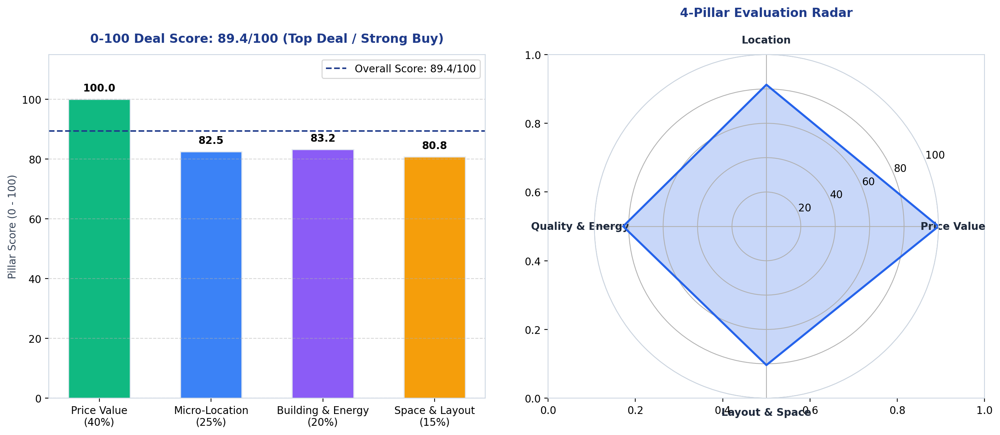
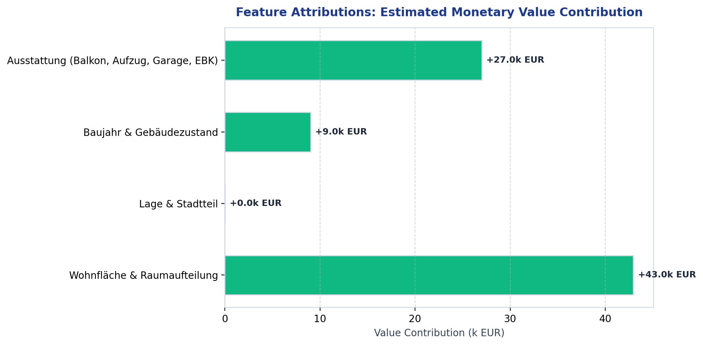
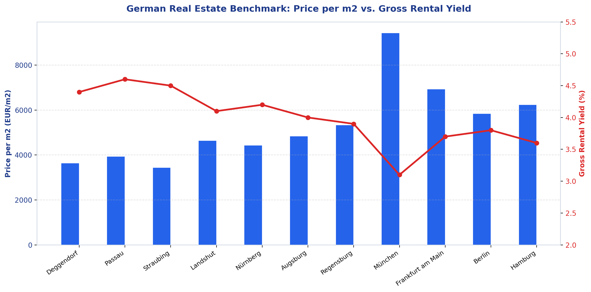

# German Real Estate Market Analyzer & Valuation Engine

A Python platform for analyzing German residential real estate markets, predicting fair market property valuations with hedonic regression models, tracking historical price trends (2018-2026), and scoring property listings on a 0-100 scale.

Supported regions include Bavarian regional centers (Deggendorf, Passau, Regensburg, Munich, Nuremberg, Augsburg, Ingolstadt, Wuerzburg, Erlangen, Bamberg, Bayreuth, Straubing, Landshut, Rosenheim) and major German metropolitan areas (Berlin, Hamburg, Frankfurt am Main, Cologne, Stuttgart, Duesseldorf, Leipzig, Dresden, Heidelberg, Freiburg im Breisgau).

---

## Visual Analytics & Platform Highlights

### 1. Market Overview & Geo-Spatial Analysis
Analyze price distributions, square meter rates, and district-level price variations across any selected German city.



### 2. Historical Price Trends & Regression (2018-2026)
Track historical price dynamics through low-interest expansion (2018-2022), interest rate corrections (2022-2024), and market stabilization (2024-2026), with forward regression forecasts and 95% confidence intervals.



### 3. 0-100 Deal Score & 4-Pillar Evaluation
Evaluate any property listing against four key dimensions: Price Attractiveness (40%), Micro-Location (25%), Building Quality & Energy Standard (20%), and Living Space & Layout Efficiency (15%).



### 4. Explainable Value Drivers & Feature Attributions
Understand the precise monetary impact (in EUR) of individual property characteristics such as living space, micro-location, building age, energy efficiency, balcony, elevator, and parking.



### 5. Multi-City Comparison & Gross Rental Yields
Compare benchmark prices per square meter and gross rental yields across German regional markets.



---

## Core Capabilities

- **City-Level Market Intelligence**: Computes average and median price per square meter (EUR/m2), total price distributions, and gross rental yield benchmarks.
- **Geo-Spatial Analysis**: Visualizes active property listings and price levels on interactive maps with district-level breakdowns.
- **Historical Price Trends & Regression (2018-2026)**: Models market price dynamics across low-interest expansion, rate corrections, and recovery phases, with forward projections and confidence intervals.
- **Listing URL & HTML Parser**: Extracts asking price, living area, room count, construction year, energy certificate class (A+ to H), and amenities from real estate portals (Immobilienscout24, Immowelt, Kleinanzeigen) and structured JSON-LD / Next.js payloads.
- **Hedonic Valuation Model**: Combines gradient boosting and random forest regression to estimate fair market value, confidence intervals, and feature attributions (monetary impact of space, location, building age, and amenities).
- **0-100 Deal Scoring Engine**: Evaluates listings across four pillars:
  1. Price Attractiveness (40%): Difference between asking price and model-estimated fair market value.
  2. Micro-Location (25%): Proximity to city center, transit hubs, university campus, and district prestige.
  3. Building Quality & Energy (20%): Construction year, renovation status, and energy efficiency rating.
  4. Space & Layout Efficiency (15%): Space-to-room ratio and amenities (balcony, elevator, parking, kitchen).
- **Interactive Web App & CLI**: Provides a full Streamlit dashboard and a standalone command-line evaluation tool.

---

## Installation

### Prerequisites
- Python 3.10 or higher
- pip

### Setup
```bash
git clone https://github.com/walid2004/German-Real-estate-Analyser.git
cd German-Real-estate-Analyser
pip install -r requirements.txt
```

---

## Usage

### 1. Interactive Web Dashboard
Run the Streamlit application:
```bash
streamlit run app.py
```
Open `http://localhost:8501` in your browser.

### 2. Command-Line Interface (CLI)

Evaluate a pre-configured sample listing:
```bash
python evaluate_listing.py --city Deggendorf --sample deggendorf_top_deal
```

Evaluate a live listing by URL:
```bash
python evaluate_listing.py --city Passau --url "https://www.immobilienscout24.de/expose/12345"
```

Evaluate custom property parameters:
```bash
python evaluate_listing.py --city Deggendorf --price 265000 --sqm 78 --rooms 3 --year 2019 --energy A --district Schaching --balcony --parking --kitchen
```

---

## Project Structure

```
.
├── app.py                         # Streamlit web dashboard
├── evaluate_listing.py            # CLI property evaluation script
├── requirements.txt               # Project dependencies
├── .github/
│   └── workflows/
│       └── ci.yml                 # GitHub Actions continuous integration workflow
├── assets/                        # High-resolution chart figures and documentation visuals
├── scripts/
│   └── generate_charts.py         # Script to render publication-quality chart figures
├── src/
│   ├── config.py                  # Configuration constants and scoring weights
│   ├── data/
│   │   ├── german_cities.py       # City registry, coordinates, districts, and benchmarks
│   │   ├── market_generator.py    # Realistic market data generator and historical series
│   │   └── data_loader.py         # Data caching and ingestion
│   ├── scrapers/
│   │   ├── base_scraper.py        # PropertyListing schema and data models
│   │   ├── listing_url_parser.py  # URL and HTML parser for real estate listings
│   │   └── web_scraper.py         # Search scraper and data pipeline
│   ├── ml/
│   │   ├── preprocessing.py       # Feature engineering, transformers, and split logic
│   │   ├── valuation_model.py     # Hedonic valuation ensemble and feature attribution
│   │   └── trend_regressor.py     # Time-series regression and price trend forecaster
│   ├── valuation/
│   │   └── deal_scorer.py         # 0-100 Deal scoring algorithm and negotiation advisor
│   └── utils/
│       ├── geo_utils.py           # Haversine distance and location scoring formulas
│       └── formatters.py          # Currency, area, and energy class formatting
└── tests/
    ├── test_scrapers.py           # Parser and schema tests
    ├── test_ml_models.py          # Model training, validation, and regression tests
    └── test_deal_scorer.py        # Scoring engine and boundary tests
```

---

## Testing

Run the automated test suite with pytest:
```bash
python -m pytest tests/ -v
```

---

## License

MIT License.
